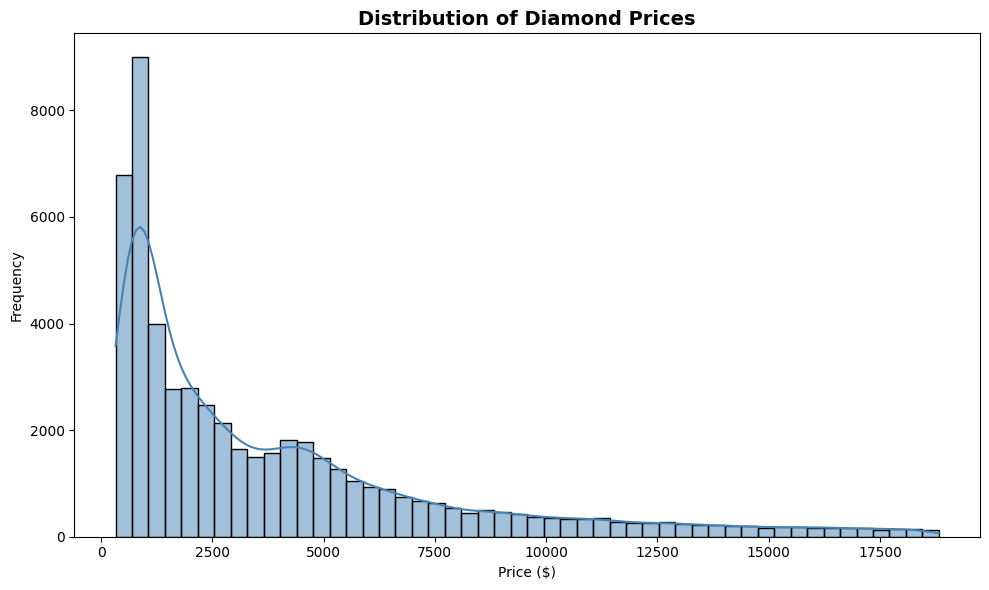
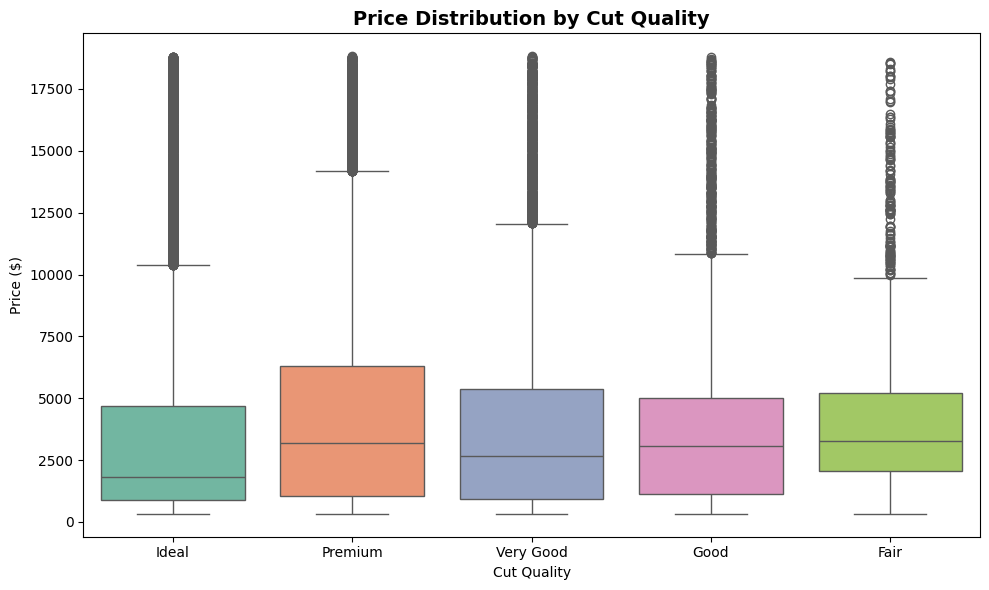
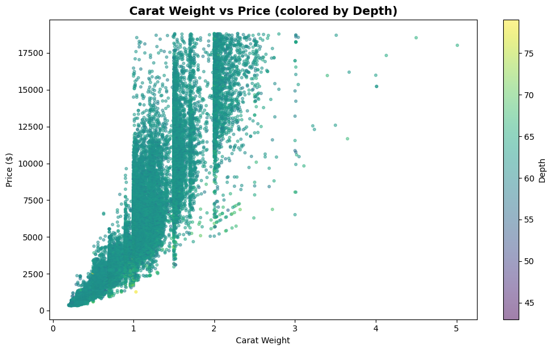
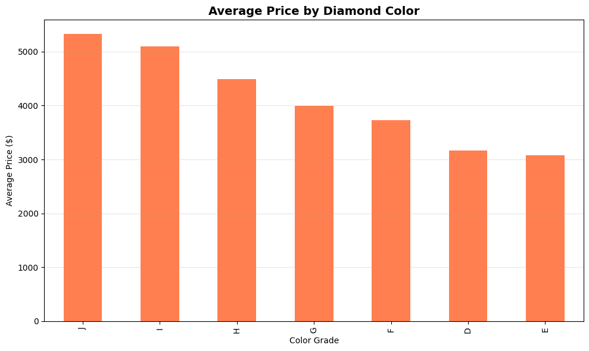
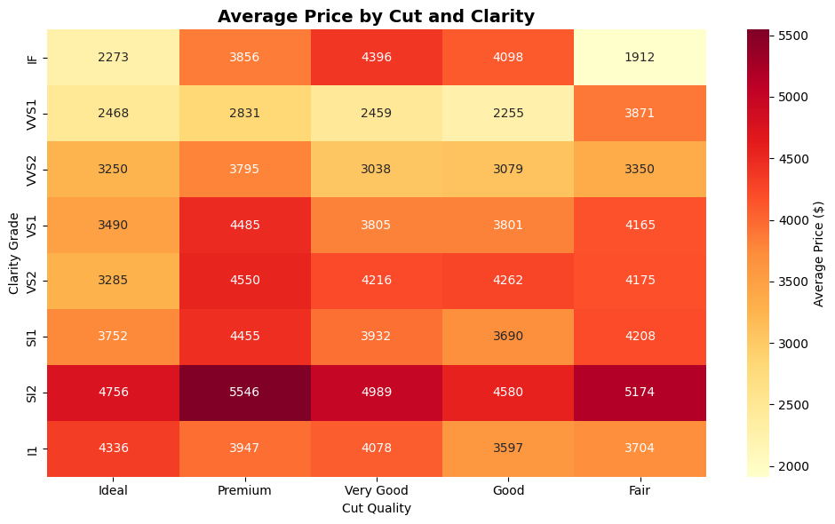
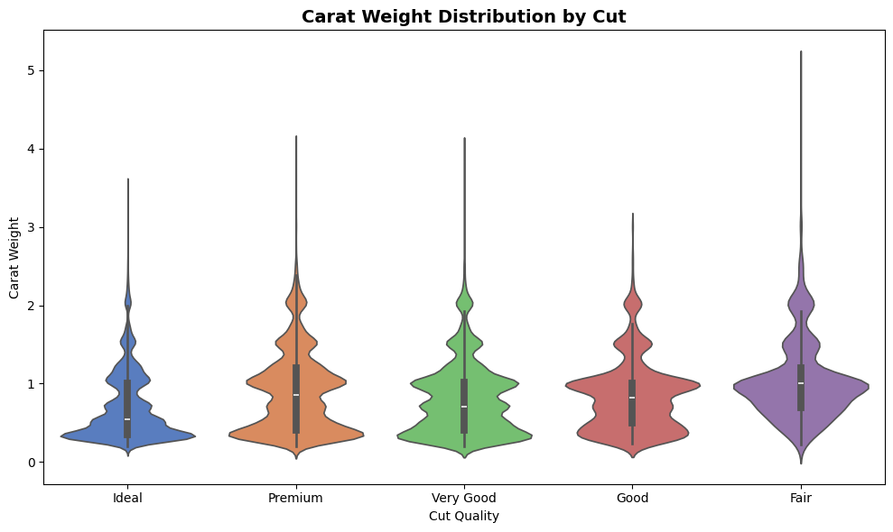
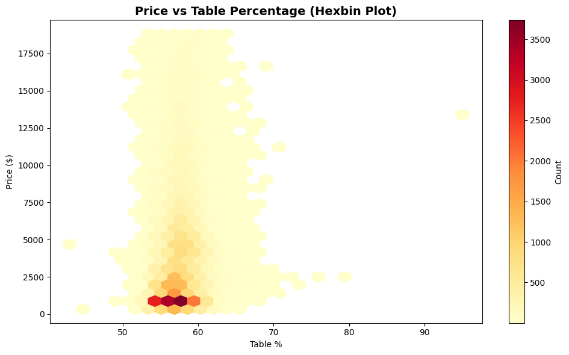
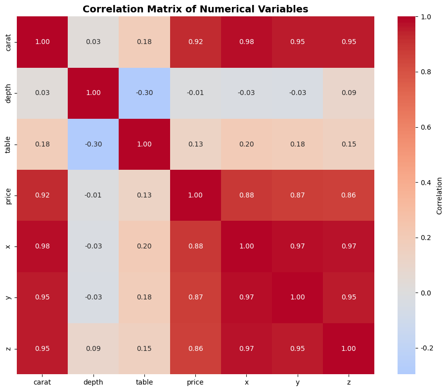
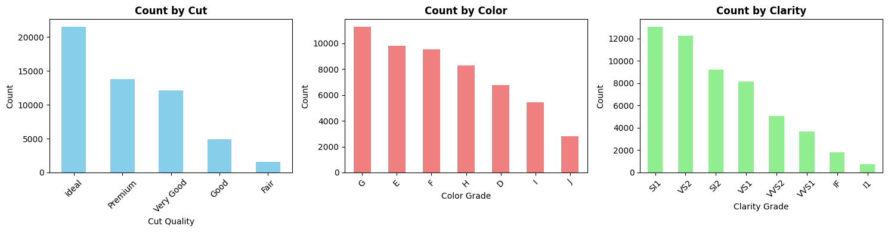
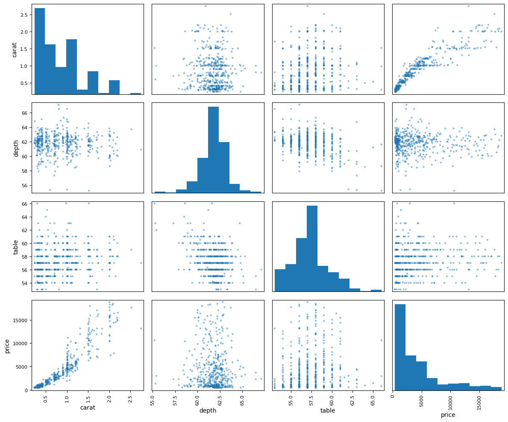

# Diamond Dataset EDA Report

**생성일**: 2025-12-26 08:28:58


## 목차

1. [데이터 개요](#데이터-개요)

2. [기초 기술통계](#기초-기술통계)

3. [데이터 시각화](#데이터-시각화)


---

## 데이터 개요

**데이터 크기**: 53940 rows × 10 columns


**컬럼 정보**:

```

None

```


**처음 5개 행**:

|    |   carat | cut     | color   | clarity   |   depth |   table |   price |    x |    y |    z |
|---:|--------:|:--------|:--------|:----------|--------:|--------:|--------:|-----:|-----:|-----:|
|  0 |    0.23 | Ideal   | E       | SI2       |    61.5 |      55 |     326 | 3.95 | 3.98 | 2.43 |
|  1 |    0.21 | Premium | E       | SI1       |    59.8 |      61 |     326 | 3.89 | 3.84 | 2.31 |
|  2 |    0.23 | Good    | E       | VS1       |    56.9 |      65 |     327 | 4.05 | 4.07 | 2.31 |
|  3 |    0.29 | Premium | I       | VS2       |    62.4 |      58 |     334 | 4.2  | 4.23 | 2.63 |
|  4 |    0.31 | Good    | J       | SI2       |    63.3 |      58 |     335 | 4.34 | 4.35 | 2.75 |


---

## 기초 기술통계


### 기술통계 1: 전체 수치형 변수 기술통계

|       |        carat |       depth |       table |    price |           x |           y |            z |
|:------|-------------:|------------:|------------:|---------:|------------:|------------:|-------------:|
| count | 53940        | 53940       | 53940       | 53940    | 53940       | 53940       | 53940        |
| mean  |     0.79794  |    61.7494  |    57.4572  |  3932.8  |     5.73116 |     5.73453 |     3.53873  |
| std   |     0.474011 |     1.43262 |     2.23449 |  3989.44 |     1.12176 |     1.14213 |     0.705699 |
| min   |     0.2      |    43       |    43       |   326    |     0       |     0       |     0        |
| 25%   |     0.4      |    61       |    56       |   950    |     4.71    |     4.72    |     2.91     |
| 50%   |     0.7      |    61.8     |    57       |  2401    |     5.7     |     5.71    |     3.53     |
| 75%   |     1.04     |    62.5     |    59       |  5324.25 |     6.54    |     6.54    |     4.04     |
| max   |     5.01     |    79       |    95       | 18823    |    10.74    |    58.9     |    31.8      |


### 기술통계 2: 카테고리형 변수 빈도


### 기술통계 3: 결측치 확인

|         |   결측치 개수 |
|:--------|---------:|
| carat   |        0 |
| cut     |        0 |
| color   |        0 |
| clarity |        0 |
| depth   |        0 |
| table   |        0 |
| price   |        0 |
| x       |        0 |
| y       |        0 |
| z       |        0 |


### 기술통계 4: 수치형 변수 상관계수

|       |     carat |      depth |     table |      price |          x |          y |         z |
|:------|----------:|-----------:|----------:|-----------:|-----------:|-----------:|----------:|
| carat | 1         |  0.0282243 |  0.181618 |  0.921591  |  0.975094  |  0.951722  | 0.953387  |
| depth | 0.0282243 |  1         | -0.295779 | -0.0106474 | -0.0252892 | -0.0293407 | 0.0949239 |
| table | 0.181618  | -0.295779  |  1        |  0.127134  |  0.195344  |  0.18376   | 0.150929  |
| price | 0.921591  | -0.0106474 |  0.127134 |  1         |  0.884435  |  0.865421  | 0.861249  |
| x     | 0.975094  | -0.0252892 |  0.195344 |  0.884435  |  1         |  0.974701  | 0.970772  |
| y     | 0.951722  | -0.0293407 |  0.18376  |  0.865421  |  0.974701  |  1         | 0.952006  |
| z     | 0.953387  |  0.0949239 |  0.150929 |  0.861249  |  0.970772  |  0.952006  | 1         |


### 기술통계 5: Cut별 가격(price) 기술통계

| cut       |   count |    mean |     std |   min |     25% |    50% |     75% |   max |
|:----------|--------:|--------:|--------:|------:|--------:|-------:|--------:|------:|
| Ideal     |   21551 | 3457.54 | 3808.4  |   326 |  878    | 1810   | 4678.5  | 18806 |
| Premium   |   13791 | 4584.26 | 4349.2  |   326 | 1046    | 3185   | 6296    | 18823 |
| Very Good |   12082 | 3981.76 | 3935.86 |   336 |  912    | 2648   | 5372.75 | 18818 |
| Good      |    4906 | 3928.86 | 3681.59 |   327 | 1145    | 3050.5 | 5028    | 18788 |
| Fair      |    1610 | 4358.76 | 3560.39 |   337 | 2050.25 | 3282   | 5205.5  | 18574 |


### 기술통계 6: Color별 가격(price) 기술통계

| color   |   count |    mean |     std |   min |    25% |    50% |     75% |   max |
|:--------|--------:|--------:|--------:|------:|-------:|-------:|--------:|------:|
| D       |    6775 | 3169.95 | 3356.59 |   357 |  911   | 1838   | 4213.5  | 18693 |
| E       |    9797 | 3076.75 | 3344.16 |   326 |  882   | 1739   | 4003    | 18731 |
| F       |    9542 | 3724.89 | 3784.99 |   342 |  982   | 2343.5 | 4868.25 | 18791 |
| G       |   11292 | 3999.14 | 4051.1  |   354 |  931   | 2242   | 6048    | 18818 |
| H       |    8304 | 4486.67 | 4215.94 |   337 |  984   | 3460   | 5980.25 | 18803 |
| I       |    5422 | 5091.87 | 4722.39 |   334 | 1120.5 | 3730   | 7201.75 | 18823 |
| J       |    2808 | 5323.82 | 4438.19 |   335 | 1860.5 | 4234   | 7695    | 18710 |


---

## 데이터 시각화


### 시각화 1: 가격(Price) 분포




**기술통계 (Price 분포)**:

|          |    Value |
|:---------|---------:|
| 평균       |  3932.8  |
| 중앙값      |  2401    |
| 표준편차     |  3989.44 |
| 최솟값      |   326    |
| 최댓값      | 18823    |
| 사분위수 25% |   950    |
| 사분위수 75% |  5324.25 |


### 시각화 2: Cut별 가격 분포 (Box Plot)




**기술통계 (Cut별 가격 요약)**:

| cut       |   ('mean', 'price') |   ('median', 'price') |   ('std', 'price') |   ('count', 'price') |
|:----------|--------------------:|----------------------:|-------------------:|---------------------:|
| Ideal     |             3457.54 |                1810   |            3808.4  |                21551 |
| Premium   |             4584.26 |                3185   |            4349.2  |                13791 |
| Very Good |             3981.76 |                2648   |            3935.86 |                12082 |
| Good      |             3928.86 |                3050.5 |            3681.59 |                 4906 |
| Fair      |             4358.76 |                3282   |            3560.39 |                 1610 |


### 시각화 3: Carat vs Price 산점도




**기술통계 (Depth 구간별 가격)**:

| depth_range    |   ('mean', 'price') |   ('median', 'price') |   ('count', 'price') |
|:---------------|--------------------:|----------------------:|---------------------:|
| (42.964, 50.2] |             4148    |                4032   |                    3 |
| (50.2, 57.4]   |             3835.34 |                2840.5 |                  316 |
| (57.4, 64.6]   |             3921.99 |                2375   |                52509 |
| (64.6, 71.8]   |             4482.77 |                3511   |                 1106 |
| (71.8, 79.0]   |             2223    |                2508.5 |                    6 |


### 시각화 4: 다이아몬드 색상(Color)별 평균 가격




**기술통계 (Color별 가격 요약)**:

| color   |   ('mean', 'price') |   ('median', 'price') |   ('std', 'price') |   ('min', 'price') |   ('max', 'price') |
|:--------|--------------------:|----------------------:|-------------------:|-------------------:|-------------------:|
| D       |             3169.95 |                1838   |            3356.59 |                357 |              18693 |
| E       |             3076.75 |                1739   |            3344.16 |                326 |              18731 |
| F       |             3724.89 |                2343.5 |            3784.99 |                342 |              18791 |
| G       |             3999.14 |                2242   |            4051.1  |                354 |              18818 |
| H       |             4486.67 |                3460   |            4215.94 |                337 |              18803 |
| I       |             5091.87 |                3730   |            4722.39 |                334 |              18823 |
| J       |             5323.82 |                4234   |            4438.19 |                335 |              18710 |


### 시각화 5: Cut과 Clarity별 평균 가격 히트맵




**기술통계 (Cut & Clarity별 평균 가격 피봇 테이블)**:

| clarity   |   Ideal |   Premium |   Very Good |    Good |    Fair |
|:----------|--------:|----------:|------------:|--------:|--------:|
| IF        | 2272.91 |   3856.14 |     4396.22 | 4098.32 | 1912.33 |
| VVS1      | 2468.13 |   2831.21 |     2459.44 | 2254.77 | 3871.35 |
| VVS2      | 3250.29 |   3795.12 |     3037.77 | 3079.11 | 3349.77 |
| VS1       | 3489.74 |   4485.46 |     3805.35 | 3801.45 | 4165.14 |
| VS2       | 3284.55 |   4550.33 |     4215.76 | 4262.24 | 4174.72 |
| SI1       | 3752.12 |   4455.27 |     3932.39 | 3689.53 | 4208.28 |
| SI2       | 4755.95 |   5545.94 |     4988.69 | 4580.26 | 5173.92 |
| I1        | 4335.73 |   3947.33 |     4078.23 | 3596.64 | 3703.53 |


### 시각화 6: Cut별 Carat 무게 분포




**기술통계 (Cut별 Carat 무게 요약)**:

| cut       |   ('mean', 'carat') |   ('median', 'carat') |   ('std', 'carat') |   ('min', 'carat') |   ('max', 'carat') |
|:----------|--------------------:|----------------------:|-------------------:|-------------------:|-------------------:|
| Ideal     |            0.702837 |                  0.54 |           0.432876 |               0.2  |               3.5  |
| Premium   |            0.891955 |                  0.86 |           0.515262 |               0.2  |               4.01 |
| Very Good |            0.806381 |                  0.71 |           0.459435 |               0.2  |               4    |
| Good      |            0.849185 |                  0.82 |           0.454054 |               0.23 |               3.01 |
| Fair      |            1.04614  |                  1    |           0.516404 |               0.22 |               5.01 |


### 시각화 7: Table 비율과 Price의 관계




**기술통계 (Table 구간별 가격)**:

| table_range    |   ('mean', 'price') |   ('median', 'price') |   ('count', 'price') |
|:---------------|--------------------:|----------------------:|---------------------:|
| (42.948, 53.4] |             3345.81 |                1590   |                  671 |
| (53.4, 63.8]   |             3936.95 |                2402.5 |                52680 |
| (63.8, 74.2]   |             4220.95 |                2980   |                  586 |
| (74.2, 84.6]   |             2331.5  |                2331.5 |                    2 |
| (84.6, 95.0]   |            13387    |               13387   |                    1 |


### 시각화 8: 수치형 변수 상관계수 히트맵




**기술통계 (상관계수 행렬)**:

|       |     carat |      depth |     table |      price |          x |          y |         z |
|:------|----------:|-----------:|----------:|-----------:|-----------:|-----------:|----------:|
| carat | 1         |  0.0282243 |  0.181618 |  0.921591  |  0.975094  |  0.951722  | 0.953387  |
| depth | 0.0282243 |  1         | -0.295779 | -0.0106474 | -0.0252892 | -0.0293407 | 0.0949239 |
| table | 0.181618  | -0.295779  |  1        |  0.127134  |  0.195344  |  0.18376   | 0.150929  |
| price | 0.921591  | -0.0106474 |  0.127134 |  1         |  0.884435  |  0.865421  | 0.861249  |
| x     | 0.975094  | -0.0252892 |  0.195344 |  0.884435  |  1         |  0.974701  | 0.970772  |
| y     | 0.951722  | -0.0293407 |  0.18376  |  0.865421  |  0.974701  |  1         | 0.952006  |
| z     | 0.953387  |  0.0949239 |  0.150929 |  0.861249  |  0.970772  |  0.952006  | 1         |


### 시각화 9: Cut, Color, Clarity별 다이아몬드 개수




**기술통계 (Cut, Color, Clarity 빈도)**:


*Cut별 개수*:

| cut       |   Count |
|:----------|--------:|
| Ideal     |   21551 |
| Premium   |   13791 |
| Very Good |   12082 |
| Good      |    4906 |
| Fair      |    1610 |

*Color별 개수*:

| color   |   Count |
|:--------|--------:|
| G       |   11292 |
| E       |    9797 |
| F       |    9542 |
| H       |    8304 |
| D       |    6775 |
| I       |    5422 |
| J       |    2808 |

*Clarity별 개수*:

| clarity   |   Count |
|:----------|--------:|
| SI1       |   13065 |
| VS2       |   12258 |
| SI2       |    9194 |
| VS1       |    8171 |
| VVS2      |    5066 |
| VVS1      |    3655 |
| IF        |    1790 |
| I1        |     741 |


### 시각화 10: 주요 수치형 변수 Pair Plot




**기술통계 (주요 수치형 변수 상관관계)**:

|       |     carat |      depth |     table |      price |
|:------|----------:|-----------:|----------:|-----------:|
| carat | 1         |  0.0282243 |  0.181618 |  0.921591  |
| depth | 0.0282243 |  1         | -0.295779 | -0.0106474 |
| table | 0.181618  | -0.295779  |  1        |  0.127134  |
| price | 0.921591  | -0.0106474 |  0.127134 |  1         |


---

## 주요 발견사항

- **총 다이아몬드 개수**: 53,940개

- **평균 가격**: $3,932.80

- **가격 범위**: $326 - $18,823

- **평균 Carat 무게**: 0.798

- **가장 많은 Cut**: Ideal

- **가장 흔한 Color**: G

- **가장 흔한 Clarity**: SI1


---

*Report generated automatically by Python EDA Script*

